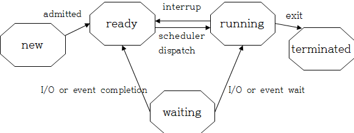
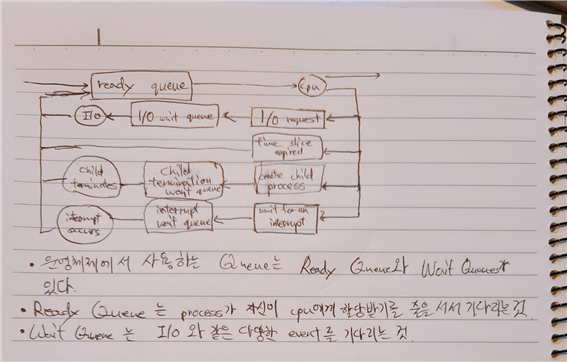

### OS Structure
-------------------------------------------
1. 프로세스 상태와 전이(transition)가 되는 시점
State of Process  

    New : 프로세스 생성단계
    Ready : 프로세스가 프로세서에게 처리되길 대기중
    Waiting : I/O 또는 event 처리
    Running : 프로세스가 프로세서에 의하여 처리중
    Terminated : 프로세스 종료

    New to Ready : 프로세스가 생성되면 대기상태로 전환
    Ready to Running : 자기가 처리될 차례가 옴
    Running to Waiting : I/O 또는 event 가 생성
    Waiting to Ready : I/O 또는 event 가 완료됨
    Running to Ready : time over 같은 interrupt 발생
    Ready to Running : 해당 프로세스 처리 완료

2. context switching
    - context switch는 CPU가 하나의 프로세스를 처리하다가 다른 프로세스를 처리할 때 일어나는 과정이다.

    - CPU에서 A라는 프로세스가 처리되는 과정에서 interrupt 또는 system call로 인해 B라는 프로세스를 처리해야 할 경우, A_프로세스를 PCB_A 에 save한다. 이 것을 context save라고 한다.

    - 이어서 B_프로세스를 PCB_B에서 가져와서 처리하게 되는데 이것을 context reload라고 한다.

3. Queue
Queue  

4. process를 fork 하고 exec 하는 과정 - code
        int main(){
            pid t pid;
            pid = fork() // fork() 를 통해 child process 생성
            if (pid < 0 ){ // pid 가 음수 값이면 fork 실패 에러 메세지
                fprintf(stderr, "Fork Failed");
                return 1;
            }
            else if (pid == 0) { // pid 값이 0이면 child process
                execlp("/bin/ls","ls",NULL);
            }
            else{ // pid값이 양수면 parent process로 child가 끝날 때 까지 기다림
                wait(NULL);
                printf("Child Complete");
            }
            return 0;
        }

5. 애플리케이션 작성시 여러 프로세스로 구성하는 것의 장점
    - 프로세스간의 정보공유 가능
    - 프로세스 처리 속도 증가
    - 모듈성 증가
    - 편리성 증가

6. IPC
    - Shared memory
        프로세스들 간의 메모리를 공유하여 정보를 같이 읽고 쓰는 방법이다.
        일반적으로 버퍼를 생성하여 정보를 생성하는 producer, 정보를 사용하는 consumer로 나눠서 버퍼를 관리한다.

    - Message passing
        프로세스들끼리 Shared momory, Hardware bus, Network를 통해 communication link를 구현하고 직접 또는 간접적, 동기 또는 비동기 식으로 정보를 주고받는 방법이다.

7. client-server system에서 프로세스간 통신을 하는 방식
    - Sockets
        socket 은 네트워크 프로토콜을 이용할 수 있도록 도와주는 API 이다. 
        정보를 주고받는 Client 와 Server는 IP 와 port num 정보와 함께 socket을 생성하고 connection을 요청한다. connection이 성사 되면 서로 send, write, read 등을 통해 정보를 주고 받는다.

    - Remote Procedure Calls (RPC)
        Client는 원격지에 있는 컴퓨터의 함수를 호출할 때 사용하는 원격 함수 호출 법으로 client에서 함수이름, 파라미터를 stub로 네트워크를 통해 원격 컴퓨터에 보내면 거기서 처리하여 리턴받는 방식이다.
    